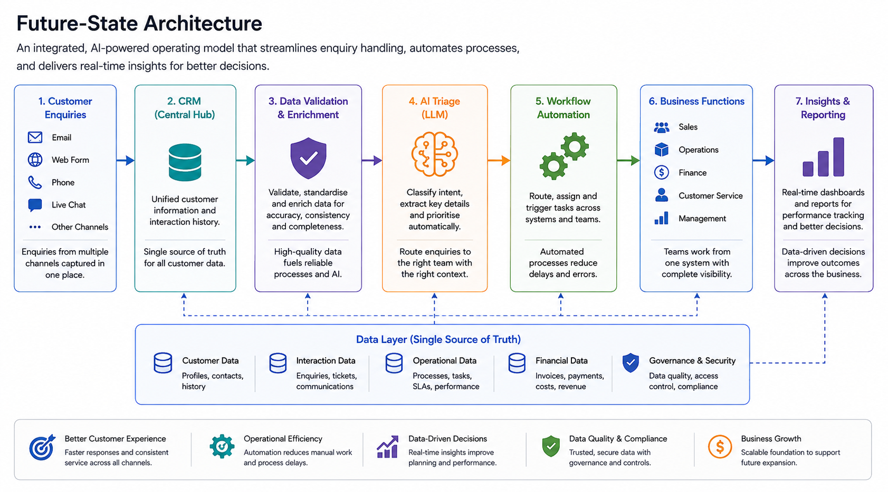
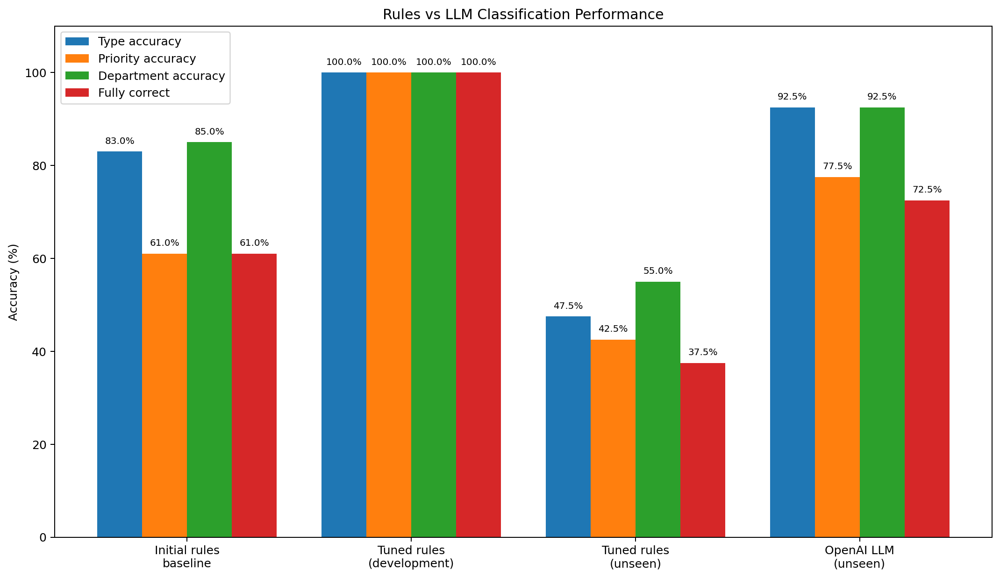

# SME | Digital Transformation
End-to-end SME digital transformation case study covering business analysis, process improvement, CRM, automation, data, change and implementation planning.
# SME Digital Transformation Case Study

## Overview

This project demonstrates an end-to-end digital transformation consulting engagement for a growing SME experiencing operational inefficiencies, fragmented customer information and limited management visibility.

The objective is to assess the organisation's current processes, identify business and technology gaps, define requirements and recommend a practical transformation roadmap.

## Future-State Architecture

The proposed solution combines a central CRM, data validation, AI-assisted triage, workflow automation and real-time reporting.

## Hybrid AI Triage Workflow

A hybrid approach combines deterministic rules, LLM classification and human review to balance speed, accuracy and control.

## Model Evaluation

The LLM generalised substantially better than the tuned rules engine on unseen enquiries.

## Client Scenario

The client is a growing organisation with approximately 500 employees operating across:

* Sales
* Customer Service
* Operations
* Finance
* IT
* Management

The organisation has expanded rapidly, but many internal processes remain manual and disconnected.

Customer information is stored across multiple spreadsheets and systems, reporting requires significant manual effort, and teams rely heavily on email to coordinate work.

As the organisation has grown, these issues have become increasingly difficult to manage, creating data duplication, process delays, inconsistent customer experiences and limited visibility for management.

## Key Challenges

Initial challenges identified include:

* Fragmented customer information
* Duplicate and inconsistent records
* Manual reporting processes
* Limited management visibility
* Slow customer onboarding
* Heavy reliance on email
* Repetitive administrative work
* Lack of standardised processes
* Limited workflow automation
* Inconsistent use of business systems

## Project Objectives

The engagement will aim to:

1. Understand the current operating environment.
2. Identify process, data and technology pain points.
3. Define business and functional requirements.
4. Identify opportunities for process improvement.
5. Assess CRM and automation requirements.
6. Develop a future-state operating model.
7. Recommend an implementation roadmap.
8. Define measurable business benefits.

## Consulting Approach

The project will follow the structure:

**Discovery → Analysis → Requirements → Solution Design → Delivery Planning → Change → Benefits Measurement**

## Planned Deliverables

The portfolio will include:

* Problem Statement
* Stakeholder Analysis
* Discovery Questions
* As-Is Process Analysis
* Pain Point Analysis
* Business Requirements
* Functional Requirements
* Data Quality Assessment
* KPI Framework
* CRM Requirements
* Automation Opportunities
* To-Be Process Design
* Implementation Roadmap
* RACI Matrix
* RAID Log
* Change Impact Assessment
* Training Plan
* Benefits Realisation Framework
* Executive Recommendations

## Portfolio Note

This is a simulated consulting engagement using fictional organisational details and synthetic data.

The project is designed to demonstrate practical business analysis, transformation, data, technology and delivery capability.
