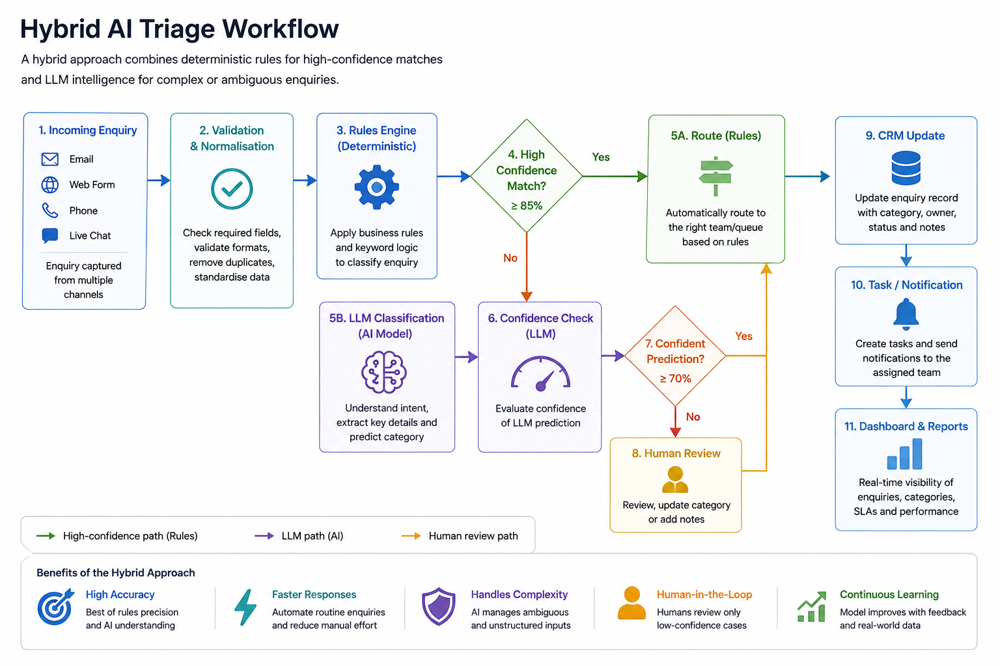
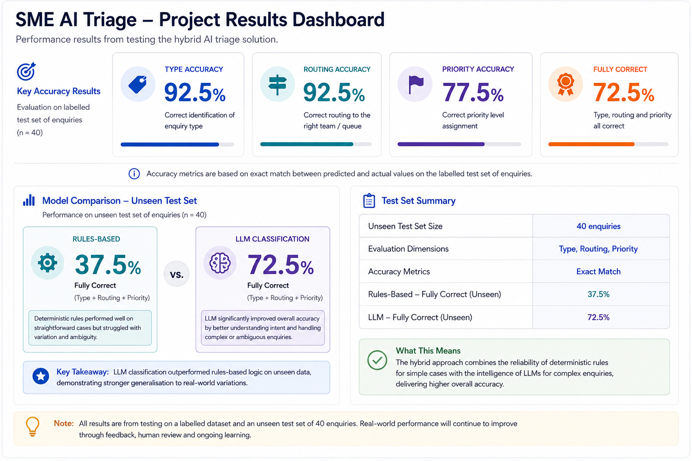

# SME Digital Transformation & AI Triage

## Project Overview

This case study is based on real-world organisational transformation, operational improvement and digital delivery work, with client and organisational details anonymised to protect confidentiality.

The project has been extended with a technical prototype to demonstrate modern CRM design, workflow automation, data architecture and AI-assisted enquiry triage.

Synthetic data is used where real client data cannot appropriately be shared.

---

## Business Context

The organisation had grown across multiple functions, but processes, responsibilities and reporting practices had not developed consistently.

This created challenges around:

| Challenge | Business Impact |
|---|---|
| Fragmented customer information | Multiple versions of customer records |
| Manual processes | Increased administrative effort |
| Inconsistent onboarding | Variable customer experience |
| Email-based hand-offs | Limited workflow visibility |
| Duplicate data | Reduced trust in reporting |
| Manual reporting | Slow access to management information |
| Unclear ownership | Delays and accountability gaps |
| Limited automation | Reduced scalability |

---

## Transformation Objective

The objective was to create a more integrated, scalable and measurable operating model by combining:

**Process Improvement + CRM + Data + Workflow Automation + AI + Management Reporting**

---

## Future-State Architecture


The future-state design introduces:

- Centralised customer information
- Standardised workflows
- Data validation
- Automated task routing
- AI-assisted enquiry triage
- Improved reporting
- Better management visibility

---

## Hybrid AI Triage Workflow



The prototype combines:

| Layer | Purpose |
|---|---|
| **Rules Engine** | Handles predictable and low-complexity cases |
| **LLM Classification** | Interprets more varied or ambiguous language |
| **Human Review** | Handles lower-confidence or higher-risk cases |
| **CRM Update** | Maintains customer and workflow records |
| **Automation** | Creates tasks, alerts and routing actions |
| **Reporting** | Tracks performance and operational outcomes |

---

## Project Results



### AI Evaluation

| Measure | Result |
|---|---:|
| Enquiry Type Accuracy | **92.5%** |
| Routing Accuracy | **92.5%** |
| Priority Accuracy | **77.5%** |
| Fully Correct Classification | **72.5%** |
| Rules-Based Fully Correct on Unseen Data | 37.5% |
| LLM Fully Correct on Unseen Data | **72.5%** |

---

## Rules vs LLM Evaluation


The rules-based classifier performed strongly after being tuned against the development dataset, but performance declined significantly when tested against unseen language.

The LLM generalised more effectively.

**Fully correct classification improved from 37.5% to 72.5% on unseen enquiries.**

This demonstrated an important delivery principle:

> High development accuracy does not automatically demonstrate reliable real-world performance.

---

## Business Analysis & Transformation Work

| Area | Work Demonstrated |
|---|---|
| **Discovery** | Problem definition, stakeholder analysis, discovery questions |
| **Process Analysis** | As-Is assessment, pain-point analysis, root cause identification |
| **Requirements** | Business requirements, functional requirements, user stories, acceptance criteria |
| **Data** | Customer data structures, validation requirements, synthetic test datasets |
| **CRM** | Customer record design, workflow stages, permissions and ownership |
| **Automation** | Routing, task creation, alerts and escalation logic |
| **AI** | Rules baseline, LLM classification, unseen testing, model evaluation |
| **Change** | Stakeholder engagement, adoption considerations and human oversight |
| **Delivery** | Solution architecture, implementation planning and benefits focus |

---

## Consulting Approach

| Stage | Focus |
|---|---|
| **Discover** | Understand the business problem and stakeholder needs |
| **Analyse** | Identify root causes, process gaps and data issues |
| **Design** | Define requirements and future-state architecture |
| **Build** | Develop workflows, prototypes and analytical components |
| **Validate** | Test performance against expected outcomes |
| **Implement** | Plan delivery, change and adoption |
| **Measure** | Track KPIs and business benefits |

---

## Technology & Methods

| Category | Tools & Methods |
|---|---|
| **Data** | Python, CSV, data validation, data modelling |
| **AI** | OpenAI API, LLM classification, prompt design, model evaluation |
| **Business Analysis** | Requirements engineering, process analysis, user stories, acceptance criteria |
| **Transformation** | CRM design, workflow automation, solution architecture |
| **Delivery** | Git, GitHub, GitHub Codespaces, iterative testing |

---

## Repository Structure

```text
01-discovery/
02-requirements/
03-solution-design/
04-data-and-analytics/
05-prototype/
assets/
````

### Key Artefacts

| Folder                  | Contents                                                        |
| ----------------------- | --------------------------------------------------------------- |
| `01-discovery`          | Problem statement, stakeholders, discovery, As-Is analysis      |
| `02-requirements`       | Business and functional requirements, user stories              |
| `03-solution-design`    | Architecture, CRM data model, automation and AI design          |
| `04-data-and-analytics` | Development and unseen test datasets                            |
| `05-prototype`          | Rules classifier, LLM classifier, evaluation and error analysis |
| `assets`                | Architecture, workflow and performance visuals                  |

---

## Key Learnings

| Principle                      | Insight                                                 |
| ------------------------------ | ------------------------------------------------------- |
| **Business Before Technology** | Technology should address a defined operational problem |
| **Simplify Before Automating** | Poor processes should not simply be automated           |
| **Validate on Unseen Data**    | Development performance alone is not enough             |
| **Use Hybrid Approaches**      | Rules and AI can complement each other                  |
| **Keep Human Oversight**       | Ambiguous or higher-risk cases need review              |
| **Measure Outcomes**           | Success should be linked to measurable business results |

---

## Portfolio Context

This project reflects the types of transformation, process, data and technology challenges I have worked on professionally.

Where real-world experience informs the case study, organisational and client details have been anonymised.

Synthetic data is used to protect confidentiality.

Selected technical elements, including the AI triage prototype and model evaluation, were developed specifically for this portfolio to demonstrate modern solution design, automation and AI capability.

---

## What This Project Demonstrates

**Business Analysis | Digital Transformation | CRM | Data | Workflow Automation | AI | Model Evaluation | Change | Delivery**


